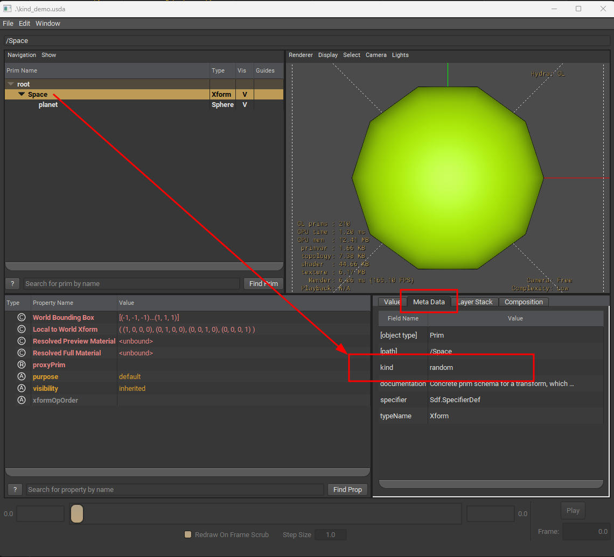

# Kind

Kind is used to categorize the prims at a higher level rather than the regular prim's schema types

It can be found under the `Meta Data` section, as shown in the image 

Kind types( generic ):
* model
* group 
* assembly
* component 
* subcomponenet

## Example
### USD file 
```python 
#usda 1.0
def Xform "Space" (
    kind = "random"
)
{
    def Sphere "planet"
    {
        color3f[] primvars:displayColor = [ (0, 1, 0) ]
    }
}

```

```admonish note
Note that we have used a custom kind `random`
```



```admonish note title="Further Reading"
* Metadatum
* KindRegistry
```

## Developer Guide
Query prim's kind using `UsdModelAPI::GetKind`


