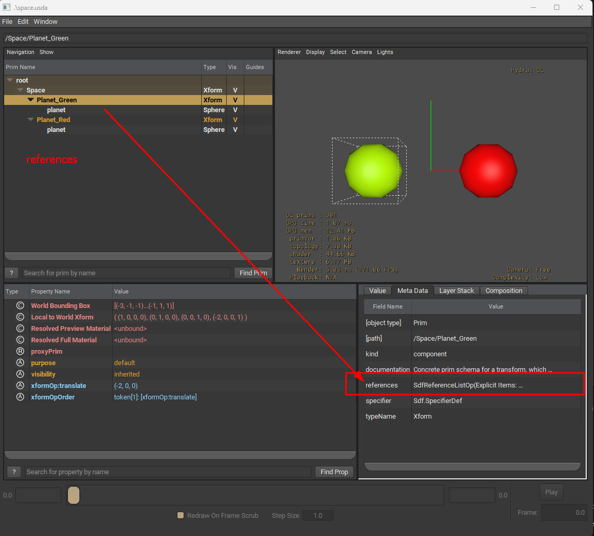

# References

## Example 
### planet.usda
```python 
#usda 1.0
( 
    defaultPrim = "Planet"
)
def Xform "Planet" (
    kind = "component"
)
{
    def Sphere "planet"
    {
        color3f[] primvars:displayColor = [ (0, 1, 0) ]
    }
}
```
### space.usda
```python
#usda 1.0

def Xform "Space" (
    kind = "assembly"
)
{
    def "Planet_Green" (
            references = @planet.usda@
        )
    {
        double3 xformOp:translate = (-2, 0, 0)
        uniform token[] xformOpOrder = [ "xformOp:translate" ]
    }

    def "Planet_Red" (
        references = @planet.usda@
    )
    {
        double3 xformOp:translate = (2, 0, 0)
        uniform token[] xformOpOrder = [ "xformOp:translate" ]

        over "planet"
        {
            color3f[] primvars:displayColor = [ (1, 0, 0) ]
        }
    }
}
```
```admonish warning 
defining a `defaultPrim` is important, without which you see the below warning and USD wouldn't refrences are not rendered properly
```

```
PS C:\Users\srikanth.potipireddi\dev\usd_prebuilt\usd\learning> usdview.cmd .\space.usda    
Warning: in _ReportErrors at line 2971 of W:\b4a5145e5e524e02\USD\pxr\usd\usd\stage.cpp -- In </Space/Planet_Red>: Unresolved reference prim path @c:/Users/srikanth.potipireddi/dev/usd_prebuilt/usd/learning/planet.usda@<defaultPrim> introduced by @space.usda@</Space/Planet_Red> (instantiating stage on stage @space.usda@ <0000023CCB45F5C0>)
Warning: in _ReportErrors at line 2971 of W:\b4a5145e5e524e02\USD\pxr\usd\usd\stage.cpp -- In </Space/Planet_Green>: Unresolved reference prim path @c:/Users/srikanth.potipireddi/dev/usd_prebuilt/usd/learning/planet.usda@<defaultPrim> introduced by @space.usda@</Space/Planet_Green> (instantiating stage on stage @space.usda@ <0000023CCB45F5C0>)
PS C:\Users\srikanth.potipireddi\dev\usd_prebuilt\usd\learning> 
```
### usdview



```admonish info
references meta data : <br>
`SdfReferenceListOp(Explicit Items: [SdfReference(planet.usda, , SdfLayerOffset(0, 1), {})])`
```